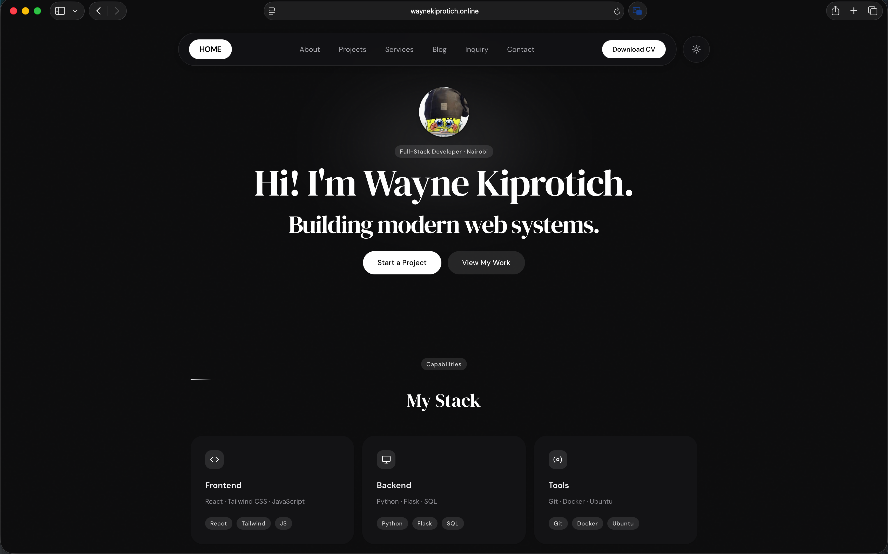

<div align="center">

# Wayne Kiprotich
### Full-Stack Software Developer

Modern developer portfolio showcasing my projects, technical skills, and software engineering journey.

**Live Website:** https://www.waynekiprotich.online

</div>

---

## Overview

This is my personal portfolio website built with **React**, **Vite**, and **Tailwind CSS**. It serves as a central place to showcase my projects, technical skills, experience, and contact information.

The website is designed with performance, accessibility, responsive design, and clean UI/UX principles in mind.

---

## Features

- Lightning-fast performance with Vite
- Fully responsive across all devices
- Dark / Light mode
- Modern UI with smooth animations
- Projects showcase
- Skills section
- Contact section
- Downloadable resume
- GitHub contribution calendar
- SEO optimized
- Open Graph support for social sharing
- Google indexing optimization
- Deployed on Vercel

---

## Tech Stack

### Frontend
- React 18
- Vite
- JavaScript (ES6+)
- HTML5
- CSS3
- Tailwind CSS

### Libraries
- React Router DOM
- Lucide React
- React GitHub Calendar
- Vercel Analytics

### Deployment
- Vercel

---

## Project Structure

```
src/
│
├── assets/
├── components/
│   ├── UI/
│   ├── Layout/
│   └── Sections/
│
├── hooks/
├── pages/
├── styles/
└── App.jsx
```

---

## Getting Started

Clone the repository
```bash
git clone https://github.com/waynekiprotich/Wayne-s-Portfolio.git
```

Navigate into the project
```bash
cd Wayne-s-Portfolio
```

Install dependencies
```bash
npm install
```

Start the development server
```bash
npm run dev
```

Build for production
```bash
npm run build
```

Preview production build
```bash
npm run preview
```

---

## Screenshots

### Homepage

<p align="center">
  
</p>

---


## Goals

This portfolio demonstrates my abilities in:

- Frontend Development
- Backend Integration
- Responsive Web Design
- UI/UX Design
- API Integration
- Performance Optimization
- SEO Best Practices
- Modern JavaScript Development

---

## Future Improvements

- Blog section
- Project filtering
- CMS integration
- Multilingual support
- Interactive coding playground
- AI-powered chatbot assistant
- Visitor analytics dashboard

---

## Connect With Me

**Website**
https://www.waynekiprotich.online

**GitHub**
https://github.com/waynekiprotich

**LinkedIn**
(Add your LinkedIn URL)

**Email**
(Add your email)

---

## Support

If you like this project, consider giving it a star on GitHub.

---

## License

This project is open source and available under the MIT License.

---

<div align="center">

**Designed & Built by Wayne Kiprotich**

</div>
